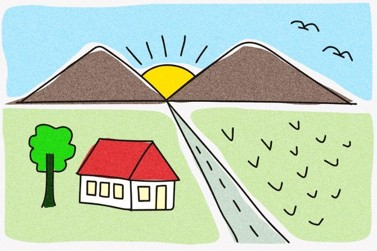

# 2D Landscape Animation

A WebGL 2 implementation of a 2D landscape illustration with custom geometry,
2D transformations, and time-based animation.

[](https://www.khronos.org/webgl/)
[](https://developer.mozilla.org/en-US/docs/Web/JavaScript)
[](https://developer.mozilla.org/en-US/docs/Web/HTML)
[](https://developer.mozilla.org/en-US/docs/Web/CSS)

**Course:** Computer Graphics — Assignment 1<br>
**Semester:** 5<br>
**Academic Domain:** Computer Graphics & Human-Computer Interaction<br>
**Author:** Bara S. Rohmani (SID 5025241144)

---

## Table of Contents

- [Overview](#overview)
- [Features](#features)
- [Scene and Animation](#scene-and-animation)
- [Implementation](#implementation)
- [Interaction](#interaction)
- [Visual Documentation (.png & .mp4)](#visual-documentation)
- [Project Structure](#project-structure)
- [Running the Project](#running-the-project)
- [Learning Outcomes](#learning-outcomes)
- [Limitations](#limitations)

---

## Overview

This project recreates a 2D landscape illustration using WebGL 2 and
custom geometric primitives.

The scene is constructed programmatically from polygons, circles, and
reusable meshes. Object placement and animation are controlled using
2D transformation matrices.

The original reference image is included for visual comparison.

<p align="center"></p>

---

## Features

- Custom 2D geometry and polygon meshes
- WebGL 2 rendering pipeline
- 3×3 transformation matrices
- Translation, rotation, and scaling
- Layered scene rendering
- Animated sunrise and sun rays
- Animated birds with wing flapping
- Animated tree canopy
- Seeded procedural grass
- Canvas click-to-restart interaction
- 3:2 canvas composition
- Reference image and visual documentation

---

## Scene and Animation

The landscape contains:

- Mountains
- Sunrise and sun rays
- Perspective road
- Green fields
- House
- Tree
- Grass
- Birds

### Animation

- The sun rises for approximately 1.5 seconds and then remains fixed.
- Sun rays follow the sunrise and continuously rotate afterward.
- Sun-ray size pulses during continuous animation.
- Two birds flap their wings while following different waving paths.
- Birds travel from the lower-left toward the upper-right before returning
  to their starting positions.
- Individual tree canopy blobs sway with different animation phases.
- 30 seeded grass blades are placed in the right-side field with
  perspective-based scaling.

---

## Implementation

### `main.js`

Handles the WebGL 2 context, shaders, reusable meshes, scene rendering,
animation state, transformations, and canvas interaction.

Scene geometry is created once and reused during rendering. Transformations
are applied through matrices rather than modifying mesh data every frame.

### `matrix3.js`

Provides the 3×3 matrix operations used for 2D transformations:

- Identity
- Translation
- Rotation
- Scaling
- Matrix multiplication

The project uses homogeneous coordinates to compose multiple transformations.

### Coordinate System

The scene uses a top-left-origin coordinate system:

```text
Origin
  ↓

(0, 0) ─────────→ X
  │
  │
  ↓
  Y
````

Scene coordinates are converted to WebGL normalized device coordinates
before rendering.

---

## Interaction

Click the rendered canvas to restart the animation from its initial state.

This makes it possible to replay the complete animation sequence without
refreshing the page.

---

## Visual Documentation

The following visual documentation is included to demonstrate the final 
rendered result and its animation.


A short 20-second video is also included as a visual record of the completed
scene and its animation.

**Documentation video:** [`docs/visual-documentation-video.mp4`](docs/visual-documentation-video.mp4)

The video shows the complete animation sequence, including the sunrise,
sun rays, birds, and tree canopy movement.

---

## Project Structure

```text
01-computer-graphics-2d-animation/

├── README.md
├── index.html
├── main.js
├── matrix3.js
├── style.css
├── module.md
└── docs/
    ├── picture.jpg
    ├── screenshot.png
    └── visual-documentation-video.mp4
```

| File                                  | Purpose                                         |
| ------------------------------------- | ----------------------------------------------- |
| `index.html`                          | Page structure and canvas/reference layout      |
| `main.js`                             | WebGL setup, geometry, rendering, and animation |
| `matrix3.js`                          | 2D transformation matrix utilities              |
| `style.css`                           | Canvas and reference-image layout               |
| `module.md`                           | Original assignment brief                       |
| `docs/picture.jpg`                    | Reference illustration                          |
| `docs/screenshot.png`                 | Screenshot of the rendered result               |
| `docs/visual-documentation-video.mp4` | 20-second visual documentation                  |

---

## Running the Project

The project uses JavaScript ES modules, so it should be served through a
local development server.

For example, with Visual Studio Code:

1. Open the project directory.
2. Start the project using Live Server or Five Server.
3. Open the generated local server URL.
4. Open `index.html`.

Opening the file directly with a `file://` URL is not supported.

### Requirements

* A modern web browser
* WebGL 2 support
* A local development server
* No package installation required
* No build step required

---

## Learning Outcomes

This project practices:

* Constructing 2D illustrations from geometric primitives
* Creating reusable WebGL meshes
* Applying translation, rotation, and scaling
* Using 3×3 transformation matrices
* Composing hierarchical transformations
* Organizing layered 2D scenes
* Creating time-based animation with `requestAnimationFrame`
* Handling basic WebGL user interaction

---

## Limitations

This project is designed as a Computer Graphics assignment rather than a
production rendering system.

The implementation intentionally uses custom WebGL 2 geometry and matrix
utilities instead of external graphics libraries. This keeps the relationship
between geometry, transformations, rendering, and animation explicit in the
source code.

The visual result is intended to reproduce the provided reference
illustration rather than provide a general-purpose 2D rendering framework.
