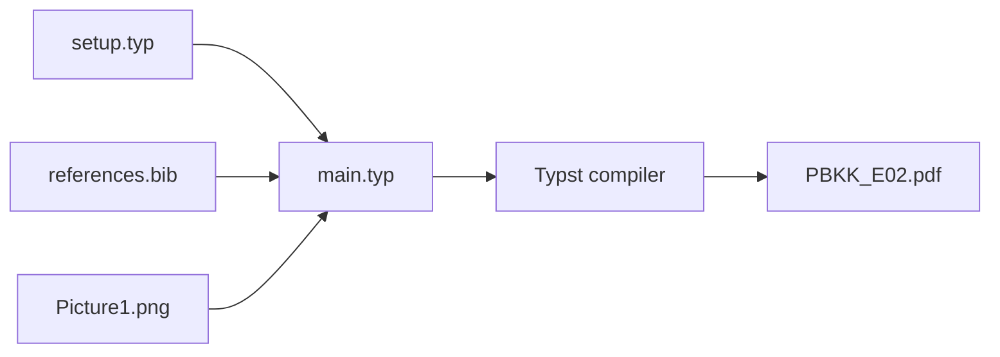

# E02: Writing a Paper in Typst

An academic-paper layout built with Typst and the [`juti`](https://juti.if.its.ac.id/) package. The included
source demonstrates common research-paper elements using an illustrative paper
about luminate decay kinetics.

**Course:** Framework-Based Programming — Assignment E02
<br>
**Typesetting:** Typst

## Table of Contents

- [Overview](#overview)
- [Objectives](#objectives)
- [Features](#features)
- [Document Pipeline](#document-pipeline)
- [Project Structure](#project-structure)
- [Requirements](#requirements)
- [Building the Paper](#building-the-paper)
- [Customization](#customization)
- [Content Note](#content-note)

## Overview

This assignment uses Typst to typeset a structured academic paper. The main
source delegates the paper layout to [`juti`](https://juti.if.its.ac.id/), while `setup.typ` supplies shared
template settings and `references.bib` stores citation data.

The sample paper includes an abstract, author and institution information,
section headings, equations, citations, a figure, a table, footnotes, and
back-matter sections.

## Objectives

The assignment demonstrates how to:

* Build an academic paper from reusable Typst package functionality.
* Organize author, affiliation, abstract, and keyword metadata.
* Add and reference equations, figures, tables, and bibliography entries.
* Separate document settings from the paper's main content.

## Features

* Paper structure with title, authors, affiliations, abstract, and keywords.
* Numbered sections and labeled equations, figures, and tables.
* Citation and bibliography integration using a BibTeX file.
* Example scientific prose, data table, and plot image.
* Shared page configuration in a separate setup file.

## Document Pipeline

`main.typ` imports the [`juti`](https://juti.if.its.ac.id/) package and settings from `setup.typ`. It uses
`references.bib` for citations and `Picture1.png` for the sample figure; Typst
then produces the PDF.



## Project Structure

```text
E02_Writing-a-Paper-in-Typst/
├── README.md
├── main.typ
├── setup.typ
├── references.bib
├── Picture1.png
└── PBKK_E02.pdf
```

### `main.typ`

Contains the paper metadata and body, including its sections, equations, figure,
table, citations, and acknowledgements.

### `setup.typ`

Provides shared settings passed to the paper template. The current setup starts
page numbering at page 1.

### `references.bib`

Contains bibliography records used by citation keys in `main.typ`.

### `Picture1.png`

The image used for the paper's results figure.

## Requirements

* Typst CLI.
* The Typst package `@preview/juti:0.1.1`.
* All local source assets listed in the project structure.

Typst resolves imported preview packages through its package system during
compilation.

## Building the Paper

From this assignment directory, compile the PDF with:

```bash
typst compile main.typ PBKK_E02.pdf
```

## Customization

Edit the paper content and metadata in `main.typ`. Add or update citation
records in `references.bib`, and keep citation keys in the source consistent
with those records. Adjust shared template settings in `setup.typ`; replace
`Picture1.png` or update its path when using another figure.

## Content Note

The paper is an illustrative typesetting sample, not a report of verified
scientific findings. Its subject matter, experimental results, and DOI are
fictitious, as indicated in the source.
