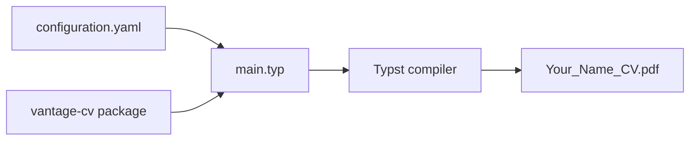

# E03: Portfolio in Typst

A configurable CV and portfolio document generated with Typst. The content is
stored separately from the layout: `configuration.yaml` holds profile and
portfolio data, while `main.typ` maps that data into the `vantage-cv` template.

**Course:** Framework-Based Programming — Assignment E03
<br>
**Typesetting:** Typst

## Table of Contents

- [Overview](#overview)
- [Objectives](#objectives)
- [Features](#features)
- [Document Pipeline](#document-pipeline)
- [Project Structure](#project-structure)
- [Requirements](#requirements)
- [Building the CV](#building-the-cv)
- [Customization](#customization)
- [Privacy Note](#privacy-note)

## Overview

This assignment demonstrates a data-driven approach to creating a CV in
Typst. The template reads structured YAML and renders profile details,
experience, education, skills, and selected contributions into a PDF.

## Objectives

The assignment demonstrates how to:

* Separate portfolio content from document layout.
* Store structured CV data in YAML and access it from Typst.
* Use a community Typst package to produce a styled document.
* Render optional links and repeatable sections from configuration data.

## Features

* Configurable contact details, position, and professional tagline.
* Experience and education entries generated from YAML lists.
* Skills, language proficiency, methodology, and notable contributions.
* Optional links for website, GitHub, LinkedIn, and education entries.
* Additional portfolio sections for aspiration, education perspective, and
	media interests.

## Document Pipeline

`main.typ` imports `vantage-cv`, loads `configuration.yaml`, and passes the
configured data and CV sections to the package. Typst compiles the source into
the included PDF.



## Project Structure

```text
E03_Portfolio-in-Typst/
├── README.md
├── main.typ
├── configuration.yaml
└── Your_Name_CV.pdf
```

### `main.typ`

Loads the YAML configuration, prepares optional profile links, and defines the
sections rendered by the CV template.

### `configuration.yaml`

Stores the CV's structured content, including profile information, experience,
education, skills, contributions, and other portfolio sections. Update this
file to change the document's content.

## Requirements

* Typst CLI.
* The Typst package `@preview/vantage-cv:1.0.0`.

Typst resolves imported preview packages through its package system during
compilation.

## Building the CV

From this assignment directory, compile the PDF with:

```bash
typst compile main.typ Your_Name_CV.pdf
```

## Customization

Update `configuration.yaml` to revise the CV data. Keep field names and data
types consistent with the values read in `main.typ`; use empty strings for
optional URLs that should not be shown. Edit `main.typ` when changing the
sections or their presentation, rather than placing layout logic in the YAML
file.

## Privacy Note

Review contact details, profile links, and other personal information in
`configuration.yaml` before publishing or sharing the source or generated PDF.
