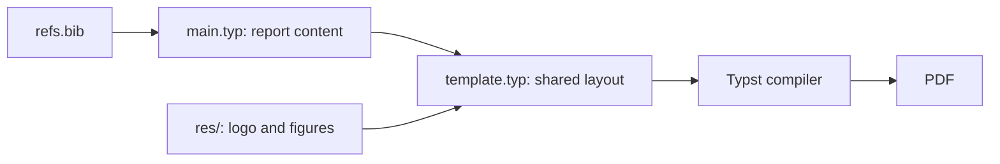

# E04: Creating a Lab Report Template

A reusable Typst template for laboratory reports, demonstrated with a sample
report about bioluminescent fungi. The report content and page styling are kept
in separate source files.

**Course:** Framework-Based Programming — Assignment E04
<br>
**Typesetting:** Typst

## Table of Contents

- [Overview](#overview)
- [Objectives](#objectives)
- [Features](#features)
- [Document Pipeline](#document-pipeline)
- [Project Structure](#project-structure)
- [Template Components](#template-components)
- [Requirements](#requirements)
- [Building the Report](#building-the-report)
- [Customization](#customization)
- [Included PDFs](#included-pdfs)

## Overview

This assignment develops a reusable layout for laboratory reports. `main.typ`
provides the report title, event, authors, affiliation, and body, while
`template.typ` defines the shared typography, heading and figure styles, page
header, and alternating footer.

The included report demonstrates the template with an abstract, scientific
sections, citations, a table, and figures.

## Objectives

The assignment demonstrates how to:

* Encapsulate report styling and page layout in a reusable Typst function.
* Pass report metadata and content into a template.
* Apply consistent heading, figure, caption, and bibliography styles.
* Include local images and references in a report document.

## Features

* Reusable template parameters for title, event, authors, affiliation, and body.
* ITS logo and report title block at the start of the document.
* Numbered headings with a consistent accent color.
* Top-positioned figures and table captions above their tables.
* APA bibliography style.
* Alternating page footer content with author details, report title, and page
	number.

## Document Pipeline

`main.typ` imports the `template` function and supplies report metadata and
content. The template uses local images under `res/`; the Typst compiler
produces the report PDF.



## Project Structure

```text
E04_Creating-a-Lab-Report-Template/
├── README.md
├── main.typ
├── template.typ
├── refs.bib
├── res/
│   ├── its-logo.png
│   ├── fig1_colony.png
│   └── fig2_growth_chart.png
├── PBKK_E04_Inclass-Template.pdf
└── target.pdf
```

### `main.typ`

Contains the sample report and passes its title, event, authors, and affiliation
to the template. It references the local figures and bibliography entries.

### `template.typ`

Defines the reusable report layout, including typography, heading and caption
styles, figure placement, APA bibliography style, title block, and page footer.
The title block references the ITS logo at `res/its-logo.png`.

### `res/`

Contains the logo and figures used by the sample report. Keep referenced asset
paths valid when replacing or moving these files.

## Template Components

The template function accepts `title`, `event`, `author`, `author-desc`, and
`body` values. To apply it to another report, provide those values in a
`#show: template.with(...)` rule, then write the report body using Typst
headings, figures, tables, and citations.

## Requirements

* Typst CLI.
* The source files and image assets included in this assignment directory.

The template uses Typst's built-in layout and bibliography features and does
not import an external package.

## Building the Report

From this assignment directory, compile a PDF with:

```bash
typst compile main.typ lab-report.pdf
```

Choose another output filename as needed. Keep `main.typ`, `template.typ`, and
the `res/` assets together so their relative paths continue to resolve.

## Customization

For another lab report, replace the sample text in `main.typ`, update the
metadata passed to `template.with(...)`, and replace or add assets in `res/`.
Adjust shared page styling in `template.typ` so the document content remains
separate from presentation.

## Included PDFs

* [PBKK E04 in-class template](PBKK_E04_Inclass-Template.pdf)
* [Target PDF](target.pdf)
