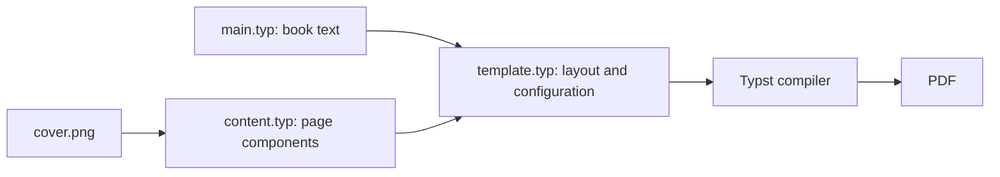

# E05: Creating a Book Template

Reusable Typst book template demonstrated through an edition of Marcus Aurelius'
_Meditations_. The assignment combines document configuration, reusable page
components, and the source text to produce a typeset book.

**Course:** Framework-Based Programming — Assignment E05
<br>
**Document:** _Meditations_, translated by George Long
<br>
**Typesetting:** Typst

## Table of Contents

- [Overview](#overview)
- [Objectives](#objectives)
- [Features](#features)
- [Document Pipeline](#document-pipeline)
- [Project Structure](#project-structure)
- [Template Components](#template-components)
- [Configuration](#configuration)
- [Requirements](#requirements)
- [Building the Book](#building-the-book)
- [Included Outputs](#included-outputs)
- [Customization](#customization)
- [Limitations](#limitations)

## Overview

This assignment builds a reusable book layout in Typst and applies it to
_Meditations_. The document is divided into a content entry point, a template
module, and reusable page content. The template controls page geometry,
typography, front and back matter, book-opening pages, running furniture, and
drop caps.

The repository includes the Typst source, a cover image, a compiled PDF, and an
HTML flipbook artifact.

## Objectives

The assignment demonstrates how to:

* Separate document content from presentation and layout logic.
* Build reusable page components with Typst functions.
* Configure page size, mirrored margins, typography, and metadata centrally.
* Use headings, outlines, counters, and page markers to manage book structure.
* Generate consistent front matter, book sections, and back matter.

## Features

* A5 page layout with inside and outside margins.
* Cover, half-title, title, copyright, epigraph, contents, and introduction pages.
* Twelve book sections, each beginning on a recto page.
* Running headers and outside folio numbers for the main text.
* Drop caps at the beginning of sections.
* A contents page with linked book headings and page numbers.
* Optional book-structure validation for the expected twelve sections.
* Configurable cover art, colors, fonts, spacing, metadata, and back-cover text.

## Document Pipeline

`main.typ` supplies the book text to the `meditations` layout defined in
`template.typ`. The template imports page components from `content.typ` and
applies the configured styles and page behavior around the text.



## Project Structure

```text
E05_Creating-a-Book-Template/
├── README.md
├── main.typ
├── template.typ
├── content.typ
├── cover.png
├── E05_Creating-a-Book-Template.pdf
└── E05_Creating-a-Book-Template_flipbook.html
```

### `main.typ`

Imports the `meditations` entry point from the template and contains the book
headings and text.

### `template.typ`

Defines the book configuration and layout behavior, including page setup,
heading parsing, front matter, running headers and footers, drop caps, and
section validation. It imports the `dropcap` function from the Typst
`droplet` package.

### `content.typ`

Defines reusable page components for the cover, half-title, title page,
copyright page, introduction, epigraph, and back cover. It also provides the
default epigraph and back-cover blurb.

### `cover.png`

The image used as the full-page front-cover artwork.

## Template Components

The front matter is arranged in book order: cover, half-title, title page,
copyright page, epigraph, contents, and introduction. The main text follows,
with each numbered book starting on a recto page. A back-cover page is appended
after the main text.

The heading parser expects book headings in this form:

```text
BOOK ONE: Written among the Quadi, on the Granua.
```

When validation is enabled, the template checks for the twelve expected book
labels, from `BOOK ONE` through `BOOK TWELVE`.

## Configuration

The `config` dictionary near the beginning of `template.typ` is the central
place to adjust the book's presentation and metadata. It includes:

* Book title, author, translator, publication details, and keywords.
* Paper size and inside/outside page margins.
* Cover image, background, and text colors.
* Body and heading fonts, font sizes, leading, and paragraph indentation.
* Running-header styling, folio number style, and muted text color.
* Drop-cap, ornament, and book-validation feature flags.
* Typesetter credit, epigraph, and back-cover blurb.

The supplied configuration is tailored to the included _Meditations_ content.
Update the metadata and page content together when adapting it for another
book.

## Requirements

* Typst CLI.
* The EB Garamond font, as named in the template configuration.
* The Typst package `@preview/droplet:0.3.1`, used for drop caps.

Typst resolves imported preview packages through its package system when
compiling. If the configured font is unavailable, install it or change the
font settings in `template.typ`.

## Building the Book

From this assignment directory, compile the PDF with:

```bash
typst compile main.typ E05_Creating-a-Book-Template.pdf
```

To recompile automatically when source files change, use:

```bash
typst watch main.typ E05_Creating-a-Book-Template.pdf
```

The HTML flipbook is included as an output artifact; its generation workflow is
not defined in the Typst source files in this directory.

## Included Outputs

* [Compiled book PDF](E05_Creating-a-Book-Template.pdf)
* [HTML flipbook](E05_Creating-a-Book-Template_flipbook.html)

## Customization

For a new book, replace or edit the source text and headings in `main.typ`,
then update the metadata and visual settings in `template.typ`. Adapt the
reusable page content in `content.typ` as needed, and keep the book headings in
the expected `BOOK <NUMBER>: <description>` format when validation is enabled.
The cover image path is relative to the Typst source and can be changed through
`config.cover-image`.

## Limitations

* The configuration and sample page content are currently tailored to
	_Meditations_; another book may need different metadata and front matter.
* Book heading parsing expects uppercase English number words and a colon before
	the description.
* The optional validator expects exactly twelve books, from `BOOK ONE` through
	`BOOK TWELVE`.
* A Typst build depends on the configured font and the external `droplet`
	package being available.
