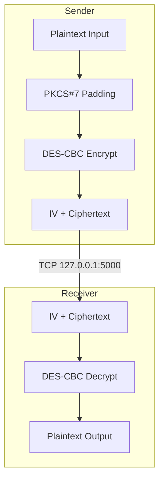
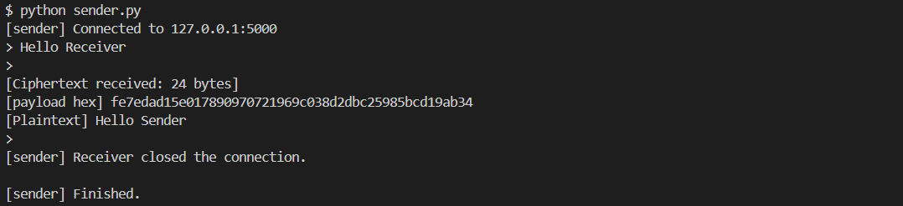
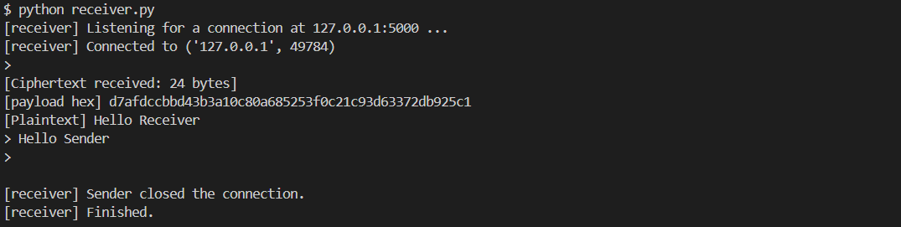
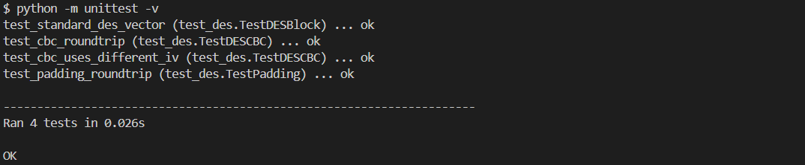
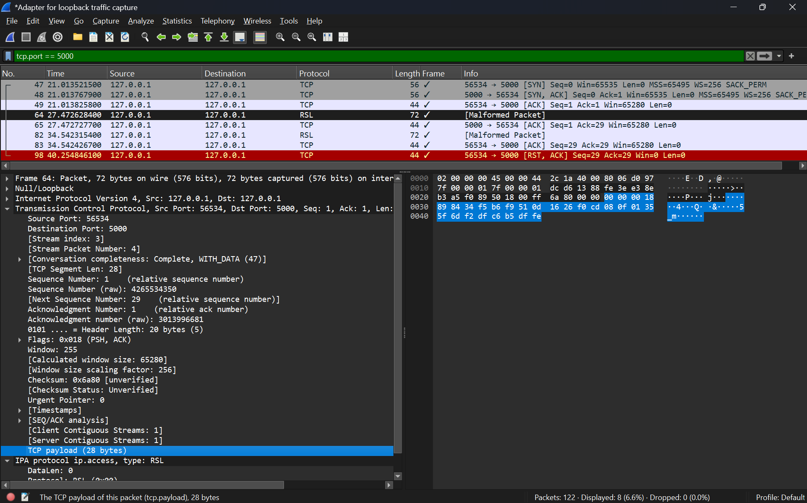

# DES TCP Communication

Manual DES Implementation for Two-Way TCP Communication

[](https://www.python.org/)
[](#tcp-message-framing)
[](#cryptographic-design)

**Course:** Information Security — Individual Assignment
<br>
**Author:** Bara S. Rohmani (SID 5025241144)
<br>
**Institution:** Informatics Engineering, ITS Surabaya

## Table of Contents

- [Overview](#overview)
- [Objectives](#objectives)
- [Features](#features)
- [Architecture](#architecture)
- [Communication Flow](#communication-flow)
- [Cryptographic Design](#cryptographic-design)
- [TCP Message Framing](#tcp-message-framing)
- [Project Structure](#project-structure)
- [Configuration](#configuration)
- [Running the Application](#running-the-application)
- [DES Testing](#des-testing)
- [Wireshark Testing](#wireshark-testing)
- [Security Considerations](#security-considerations)
- [Limitations](#limitations)
- [References](#references)

## Overview

This project implements a manual Data Encryption Standard (DES) encryption and decryption system integrated with a two-way TCP socket communication between two independent Python processes: **Sender** and **Receiver**.

The project was developed as an individual assignment for the **Information Security** course.

The main objective is to demonstrate how plaintext can be encrypted into ciphertext before transmission and decrypted by the receiving party using a shared secret key.

The DES algorithm is implemented manually without using dedicated cryptographic libraries such as `PyCryptodome` or `cryptography`.

> **Educational purpose:** This project is intended for learning and demonstration only. DES is obsolete for modern secure communication and must not be used to protect real-world sensitive information.

---

## Objectives

This project aims to demonstrate:

* Manual implementation of the DES block cipher.
* DES encryption and decryption at the block level.
* DES key scheduling and Feistel network operations.
* DES-CBC mode for multi-block messages.
* PKCS#7 padding for variable-length plaintext.
* TCP communication between two independent processes.
* Two-way encrypted communication between Sender and Receiver.
* Shared-key management without transmitting the key through the network.
* Basic verification using a standard DES known-answer test.
* Network traffic inspection using Wireshark.

---

## Features

* Manual DES implementation.
* 64-bit DES block processing.
* 16-round Feistel network.
* DES key schedule with PC-1, rotations, and PC-2.
* Eight DES S-boxes.
* DES-CBC mode.
* Random 8-byte initialization vector (IV) for each message.
* PKCS#7 padding.
* TCP communication over `127.0.0.1`.
* 4-byte big-endian length-prefix message framing.
* Independent `sender.py` and `receiver.py` processes.
* Two-way communication.
* UTF-8 text message support.
* Standard DES known-answer testing.

---

## Architecture

The system consists of two independent processes.
The communication architecture can be summarized as:



Both sides are also capable of sending encrypted responses through the same TCP connection.

```text
Sender                              Receiver

  │                                    │
  │───── encrypted message ──────────>│
  │                                    │
  │<───── encrypted response ─────────│
  │                                    │
```

---

## Communication Flow

For every message, the following process is performed:

```text
Plaintext
    │
    ▼
UTF-8 Encoding
    │
    ▼
PKCS#7 Padding
    │
    ▼
DES-CBC Encryption
    │
    ▼
IV + Ciphertext
    │
    ▼
TCP Length-Prefixed Message
    │
    ▼
Receiver
    │
    ▼
DES-CBC Decryption
    │
    ▼
PKCS#7 Unpadding
    │
    ▼
UTF-8 Decoding
    │
    ▼
Plaintext
```

The reverse process is used when the other party sends a response.

---

## Cryptographic Design

### DES

DES is a symmetric block cipher operating on 64-bit blocks.

The implementation includes the main DES components:

1. Initial Permutation (IP)
2. Key Permutation Choice 1 (PC-1)
3. Key splitting into `C` and `D`
4. Left rotations
5. Permutation Choice 2 (PC-2)
6. 16 round subkeys
7. Expansion permutation
8. XOR with the round key
9. S-box substitution
10. P permutation
11. 16 Feistel rounds
12. Final Permutation (FP)

The DES block implementation is separated from the networking code so that it can be tested independently.

### Key

The Sender and Receiver use the same pre-shared key:

```text
133457799BBCDFF1
```

The key is configured locally on both sides and is **never transmitted through the TCP connection**.

The key shown above is used for educational and testing purposes.

### DES-CBC

Because DES operates on fixed 8-byte blocks while user messages can have arbitrary lengths, this project uses:

* PKCS#7 padding
* Cipher Block Chaining (CBC)

The payload transmitted by the application has the following format:

```text
┌──────────┬──────────────────────────────┐
│ IV       │ Ciphertext                   │
│ 8 bytes  │ N × 8 bytes                  │
└──────────┴──────────────────────────────┘
```

The IV is generated randomly for each message.

The IV does not need to be secret and is transmitted together with the ciphertext.

---

## TCP Message Framing

TCP provides a byte stream rather than message boundaries.

Therefore, the project uses a 4-byte big-endian length prefix:

```text
┌──────────────────┬──────────────────────┐
│ Length (4 bytes) │ Payload              │
└──────────────────┴──────────────────────┘
```

This prevents messages from being incorrectly combined or split when received through TCP.

The `recv_exact()` function ensures that the expected number of bytes is received before processing the message.

---

## Project Structure

```text
01-des-tcp-communication/
├── README.md
├── des_manual.py
├── sender.py
├── receiver.py
├── test_des.py
└── docs/
    └── images/
        ├── two-way-communication-1.png
        ├── two-way-communication-2.png
        ├── des-testing.png
        └── wireshark-capture.png
```

### `des_manual.py`

Contains the manual DES implementation, including:

* Bit conversion
* DES permutations
* Key schedule
* S-box substitution
* Feistel function
* Block encryption/decryption
* PKCS#7 padding
* DES-CBC encryption/decryption

### `sender.py`

Implements the TCP client.

Responsibilities:

* Connect to the Receiver.
* Read plaintext from the user.
* Encrypt messages using DES-CBC.
* Send encrypted payloads.
* Receive encrypted responses.
* Decrypt received payloads.

### `receiver.py`

Implements the TCP server.

Responsibilities:

* Listen for incoming TCP connections.
* Receive encrypted messages.
* Decrypt received messages.
* Display plaintext.
* Encrypt responses.
* Send encrypted responses.

### `test_des.py`

Contains automated tests for:

* Standard DES known-answer test.
* Encryption/decryption round-trip.
* PKCS#7 padding.
* DES-CBC round-trip.
* Random IV generation.
* Incorrect-key behavior.

---

## Requirements

* Python 3.x
* Standard Python library

No external cryptographic library is required.

The networking implementation uses Python's built-in `socket` and `threading` modules.

---

## Installation

Clone or copy this project into the desired directory.

No additional Python package installation is required.

Verify Python:

```bash
python --version
```

---

## Configuration

Both `sender.py` and `receiver.py` contain the same configuration:

```python
HOST = "127.0.0.1"
PORT = 5000

KEY = bytes.fromhex("133457799BBCDFF1")
```

The following values must match on both sides:

* Host
* Port
* Shared key

The shared key must not be transmitted through the network.

---

## Running the Application

The application requires two terminal windows.

### 1. Start the Receiver

In the first terminal:

```bash
python receiver.py
```

Expected output:

```text
[receiver] Listening for a connection at 127.0.0.1:5000 ...
```

### 2. Start the Sender

In the second terminal:

```bash
python sender.py
```

Expected output:

```text
[sender] Connected to 127.0.0.1:5000
```

The Receiver should then report an established connection.

---

### Sending Messages

After both processes are connected, either side can enter a message.

Example:

```text
> Hello Receiver
```

The message is:

1. Encoded as UTF-8.
2. Padded using PKCS#7.
3. Encrypted using DES-CBC.
4. Combined with its IV.
5. Sent through the TCP connection.

The receiving side decrypts the payload and displays:

```text
[plaintext] Hello Receiver
```

The Receiver can then send a response:

```text
> Hello Sender
```

The Sender will receive and decrypt the response.

---

### Terminating the Application

Type:

```text
exit
```

or:

```text
quit
```

Alternatively, press `Ctrl+C`.

---

### Example Communication

The following screenshot shows the two independent processes communicating through TCP.




---

## DES Testing

The DES implementation should be tested independently before testing the TCP application.

Run:

```bash
python -m unittest -v
```

The tests include a standard DES known-answer test:

```text
Key:
133457799BBCDFF1

Plaintext:
0123456789ABCDEF

Expected ciphertext:
85E813540F0AB405
```

The test also verifies that:

```text
DES Decrypt(DES Encrypt(plaintext)) == plaintext
```
> **Note on the test vector:** The key/plaintext/ciphertext triple above is a widely used
> DES worked-example (not sourced directly from a NIST publication). It was cross-checked
> manually against independent implementations. For NIST-sourced values, see the
> Variable Key/Plaintext Known Answer Tests in SP 800-17, Appendix A–B.

Additional tests verify PKCS#7 padding and DES-CBC round-trip behavior for messages with different lengths.

Example test output:



---

## Wireshark Testing

Wireshark can optionally be used to observe the TCP communication.

The application communicates through:

```text
127.0.0.1:5000
```

A TCP filter can be used to focus on the application traffic:

```text
tcp.port == 5000
```

Example capture:



The captured payload should contain the application framing and encrypted payload rather than the original plaintext message.

The payload structure is:

```text
+----------------+-------------------------+-----------------------+
| Length Prefix  |            IV           |      Ciphertext       |
|    4 byte      |          8 byte         |    variable length    |
|                |                         |                       |
|  00 00 00 18   | 89 84 34 f5 b6 f9 51 0d | 16 26 f0 ... b5 df fe |
+----------------+-------------------------+-----------------------+
```

The IV is intentionally transmitted and is not considered secret.

### Important observation

The use of Wireshark in this project is intended to demonstrate the difference between the plaintext handled by the application and the encrypted payload transmitted through the network.

---

## Security Considerations

This implementation is designed for educational purposes and should not be considered a secure modern communication system.

### DES is obsolete

DES uses a 56-bit effective key and is no longer considered adequate for modern security requirements. NIST withdrew FIPS 46-3 in 2005, and its historical validation material is provided for legacy/reference purposes.

### No authentication

This project uses DES-CBC for confidentiality demonstration but does not implement a Message Authentication Code (MAC) or an authenticated encryption scheme.

Therefore, the system does not provide cryptographic integrity or authentication of messages.

### Shared key

The key is pre-configured on both endpoints.

No key exchange protocol is implemented.

This satisfies the assignment requirement that both Sender and Receiver already know the key, but it is not an appropriate key-management design for a real-world system.

### Localhost only

The current configuration uses:

```text
127.0.0.1
```

Therefore, communication occurs between processes on the same machine.

This is a logical simulation of two communicating endpoints.

---

## Limitations

The project intentionally has several limitations:

* DES is used because it is required by the assignment.
* Communication is limited to localhost.
* The shared key is manually configured.
* No key exchange protocol is implemented.
* No message authentication is implemented.
* No replay protection is implemented.
* No user authentication is implemented.
* The application is designed for text messages rather than arbitrary files.
* The implementation is intended for educational demonstration rather than production security.

---

## Learning Outcomes

Through this project, the following concepts are demonstrated:

* Symmetric-key cryptography.
* DES block cipher structure.
* Feistel networks.
* Key scheduling.
* Permutation and substitution operations.
* S-box processing.
* Block cipher modes of operation.
* CBC chaining.
* PKCS#7 padding.
* TCP client-server communication.
* TCP message framing.
* Shared-key configuration.
* Basic network traffic inspection.
* Separation of cryptographic and networking responsibilities.
* Test-driven verification of cryptographic primitives.

---

## References

### DES Specification

National Institute of Standards and Technology (NIST).

**FIPS PUB 46-3: Data Encryption Standard (DES).**

NIST FIPS 46-3:
[https://csrc.nist.gov/pubs/fips/46-3/final](https://csrc.nist.gov/pubs/fips/46-3/final)

### NIST DES Validation Information

NIST Cryptographic Algorithm Validation Program.

The historical DES validation information provides additional context regarding DES testing and its retired status.

NIST DES Validation Information:
[https://csrc.nist.gov/Projects/Cryptographic-Algorithm-Validation-Program/Retired-Testing](https://csrc.nist.gov/Projects/Cryptographic-Algorithm-Validation-Program/Retired-Testing)

---

## Disclaimer

This project was developed as an academic implementation of DES and TCP-based encrypted communication.

It demonstrates cryptographic concepts and network communication mechanisms but is not intended for protecting real-world confidential information.
